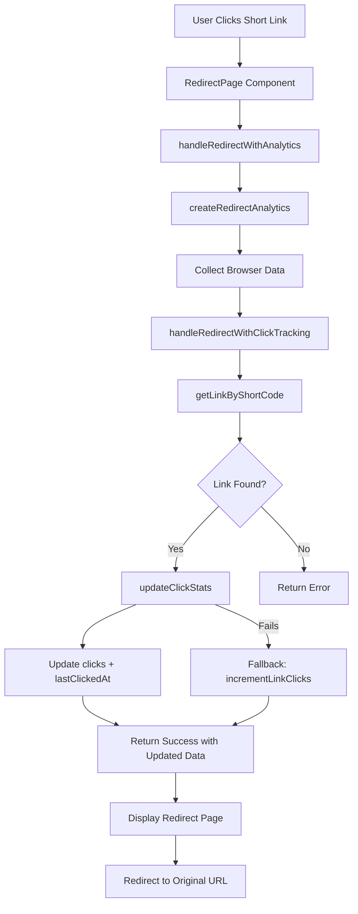

# Click Tracking Implementation

## ✅ Enhanced Click Tracking Features

This document outlines the comprehensive click tracking system implemented for the URL shortener application.

### 🎯 **Core Functionality**

When a short link is visited and redirected, the system now:

1. **✅ Increments Click Count** - Updates the `clicks` field in the database
2. **✅ Records Last Click Timestamp** - Updates `lastClickedAt` with current timestamp
3. **✅ Collects Analytics Data** - Gathers user agent, referrer, and other metrics
4. **✅ Provides Fallback Handling** - Ensures click counting works even if detailed tracking fails

### 📊 **Database Schema Updates**

#### Enhanced LinkData Interface
```typescript
export interface LinkData {
  id?: string;
  originalUrl: string;
  shortCode: string;
  createdAt: Timestamp;
  clicks: number;
  lastClickedAt?: Timestamp; // ✅ NEW: Track when link was last clicked
  userId: string;
}
```

#### Click Analytics Interface
```typescript
export interface ClickAnalytics {
  timestamp: Timestamp;
  userAgent?: string;
  referrer?: string;
  ipAddress?: string; // Placeholder for future implementation
  location?: string; // Placeholder for future implementation
  device?: string; // Placeholder for future implementation
}
```

### 🔧 **Key Functions Implemented**

#### 1. `updateClickStats(linkId, analytics?)`
**Purpose**: Comprehensive click tracking with optional analytics data

**Features**:
- Increments click count using Firestore `increment(1)`
- Updates `lastClickedAt` timestamp
- Logs analytics data for future use
- Atomic database operation

```typescript
await updateClickStats('link-id', {
  userAgent: 'Mozilla/5.0...',
  referrer: 'https://example.com'
});
```

#### 2. `handleRedirectWithAnalytics(shortCode, trackAnalytics?)`
**Purpose**: Main redirect handler with enhanced tracking

**Features**:
- Collects comprehensive analytics data
- Calls enhanced click tracking
- Provides fallback to basic tracking
- Returns updated click count in response

#### 3. `createRedirectAnalytics(shortCode, userAgent?, referrer?)`
**Purpose**: Collects comprehensive analytics data

**Data Collected**:
- ✅ User Agent
- ✅ Referrer URL
- ✅ Screen Resolution
- ✅ Browser Language
- ✅ Platform Information
- ✅ Viewport Size
- ✅ Timezone
- ✅ Timestamp

### 🚀 **Implementation Flow**



### 📱 **User Experience**

#### Before Redirect Display
Users now see enhanced information:
```
✅ Redirecting...
Taking you to: https://example.com

Short code: abc123
Total clicks: 42
Last accessed: 1/15/2024, 2:30:45 PM
✅ Click tracked successfully
```

### 🛡️ **Error Handling & Fallbacks**

#### Three-Tier Fallback System:
1. **Primary**: `updateClickStats()` with full analytics
2. **Secondary**: `incrementLinkClicks()` basic counting
3. **Tertiary**: Continue redirect even if tracking fails

#### Error Scenarios Handled:
- ✅ Database connection issues
- ✅ Analytics collection failures
- ✅ Invalid short codes
- ✅ Non-existent links
- ✅ Browser API unavailability

### 🧪 **Testing Coverage**

Comprehensive test suite includes:
- ✅ Basic click increment functionality
- ✅ Analytics data collection
- ✅ Error handling and fallbacks
- ✅ Browser environment mocking
- ✅ Database operation testing
- ✅ Edge case handling

### 📈 **Performance Considerations**

#### Lightweight Implementation:
- **Asynchronous Operations**: Click tracking doesn't block redirect
- **Atomic Updates**: Single database operation for click stats
- **Fallback Strategy**: Ensures redirect speed is maintained
- **Error Isolation**: Tracking failures don't affect core functionality

#### Database Efficiency:
```typescript
// Single atomic operation
await updateDoc(linkRef, {
  clicks: increment(1),        // Atomic increment
  lastClickedAt: Timestamp.now() // Current timestamp
});
```

### 🔮 **Future Enhancements**

#### Placeholder Fields Ready:
- **IP Address Tracking**: For geographic analytics
- **Device Detection**: Mobile/desktop/tablet classification
- **Location Services**: City/country tracking
- **Click Logs Collection**: Detailed per-click analytics

#### Potential Analytics Dashboard:
- Click trends over time
- Geographic distribution
- Device/browser analytics
- Referrer analysis
- Peak usage times

### 🚦 **Usage Examples**

#### Basic Click Tracking:
```typescript
// Automatic when user visits short link
const result = await handleRedirectWithAnalytics('abc123');
// Result includes updated click count and timestamp
```

#### Manual Click Statistics Update:
```typescript
await updateClickStats('link-id', {
  userAgent: navigator.userAgent,
  referrer: document.referrer
});
```

#### Analytics Data Collection:
```typescript
const analytics = createRedirectAnalytics('abc123');
console.log(analytics);
// Output: { shortCode, timestamp, userAgent, referrer, ... }
```

### 📋 **Configuration**

#### Environment Variables (Future):
```env
ENABLE_CLICK_TRACKING=true
ENABLE_DETAILED_ANALYTICS=true
ANALYTICS_RETENTION_DAYS=90
```

#### Feature Flags:
- Analytics collection can be disabled per request
- Fallback mechanisms ensure core functionality
- Graceful degradation in limited environments

This implementation provides a robust, scalable foundation for click tracking while maintaining excellent performance and user experience.
